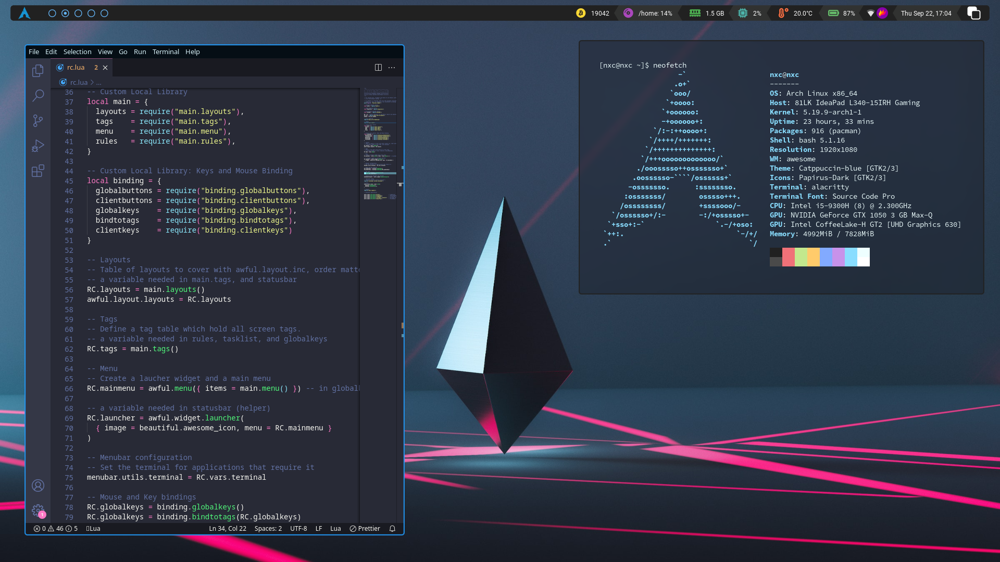

<div align="center">

<a href="https://awesomewm.org/"></a>

<div align="center">
    
    
</div>

</div>

# Rice



# Setup
1. install AwesomeWM

    **For arch users**
    ``` shell
    sudo pacman -S awesome
    ```

2. install softwares

    **For arch users**

    ```shell
   
    sudo pacman -S lxappearance lxsession rofi thunar brightnessctl papirus-icon-theme ttf-roboto ttf-font-awesome catppuccin-gtk-theme xfce4-power-manager

    yay -S picom-jonaburg-git i3lock-fancy-git lain-git pulseaudio-ctl
   
    ```

    - [picom-jonaburg](https://github.com/jonaburg/picom)
    - [rofi](https://github.com/davatorium/rofi)
    - [alacritty](https://github.com/alacritty/alacritty)
    - [thunar](https://gitlab.xfce.org/xfce/thunar)
    - [lain](https://github.com/lcpz/lain)
    - [brightnessctl](https://github.com/Hummer12007/brightnessctl)
    - [xfce4-power-manager](https://gitlab.xfce.org/xfce/xfce4-power-manager)

3. install themes

    - [Icon theme](https://github.com/PapirusDevelopmentTeam/papirus-icon-theme)
    - [Gtk theme](https://github.com/catppuccin/catppuccin)

4. install fonts

    - [Roboto](https://github.com/googlefonts/roboto)
    - [FontAwesome](https://github.com/FortAwesome/Font-Awesome)

